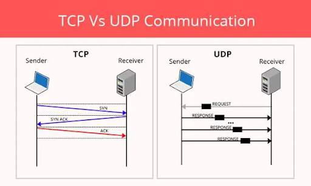

# Webove aplikace 6.10

## Zapisky
* DNS - Domain Main System -> hierarchický, decentralizovaný systém doménových jmen 
* ISP - Internet Service provider - firma nebo organiace co zprostredkovava pristup do Internetu 
- Protokoly:
       - TCP - Transmission Control Protocol -nejpouzivanejsi protokol, mohou pouzivat pocitace, ktere mohou obousměrně přenášet data.
       - UDP - User Datagram Protocol - 8 bytovy protokol, jednodusi nez TCP, nezarukuje doruceni dat
       - Porovnani TCP a UDP
           - TCP - potrebuje ustanovene spojeni pred prenosem
           - UDP - nepotrebuje ustanovene spojeni pred prenosem
           - TCP - doruceni je zaruceno
           - UDP - doruceni je nezaruceno
           - TCP - pomalejsi, ale doruci vsechna data
           - UDP - rychlejsi, ale riziko nedoruceni vsech dat

* HTML - Hypertext Markdown Language 
* V HTML rozlisuje znacky parove (body, head, p , h) a neparove (img, input, br)